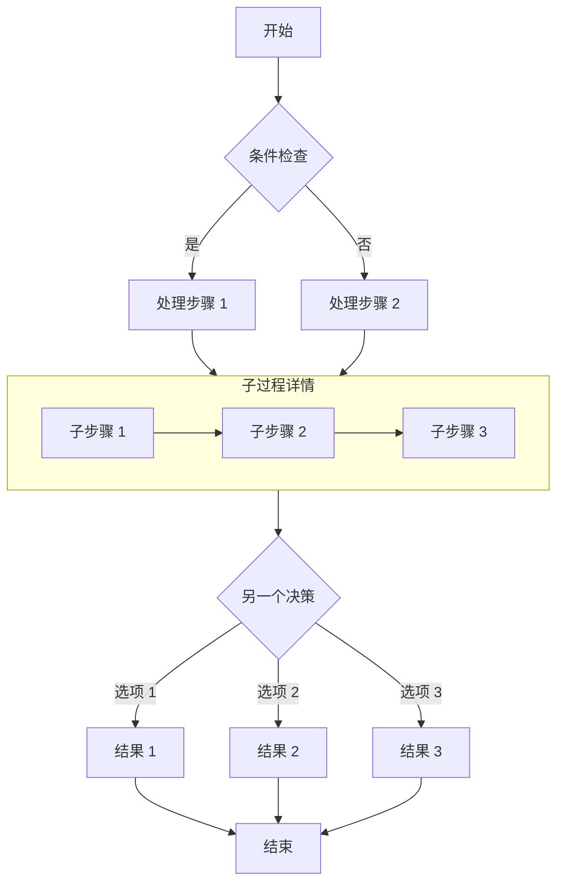

<!-- 文章内搜索栏 -->
<div id="article-search-wrap">
  <button id="article-search-btn" onclick="toggleArticleSearch()">
    <svg width="16" height="16" viewBox="0 0 24 24" fill="none" stroke="currentColor" stroke-width="2.5" stroke-linecap="round" stroke-linejoin="round"><circle cx="11" cy="11" r="8"/><line x1="21" y1="21" x2="16.65" y2="16.65"/></svg>
    <span>搜索文章</span>
  </button>
  <div id="article-search-panel" style="display:none">
    <div id="article-search-row">
      <svg width="18" height="18" viewBox="0 0 24 24" fill="none" stroke="currentColor" stroke-width="2.5" stroke-linecap="round" stroke-linejoin="round"><circle cx="11" cy="11" r="8"/><line x1="21" y1="21" x2="16.65" y2="16.65"/></svg>
      <input type="text" id="article-search-input" placeholder="输入关键词搜索..." autocomplete="off" />
      <span id="article-search-info"></span>
      <button id="article-search-prev" onclick="articleNav(-1)" title="上一个" disabled>▲</button>
      <button id="article-search-next" onclick="articleNav(1)" title="下一个" disabled>▼</button>
      <button id="article-search-close" onclick="closeArticleSearch()" title="关闭">✕</button>
    </div>
  </div>
</div>

<style>
  #article-search-wrap { margin-bottom:0; }
  #article-search-btn {
    display:inline-flex; align-items:center; gap:6px;
    padding:6px 14px; border:1px solid var(--border);
    border-radius:8px; background:var(--card-bg); color:var(--text-75);
    cursor:pointer; font-size:0.9rem; transition:all .2s;
  }
  #article-search-btn:hover {
    border-color:var(--primary); color:var(--primary);
    background:color-mix(in srgb, var(--primary) 6%, transparent);
  }
  #article-search-panel {
    padding:10px 14px; margin-top:8px; margin-bottom:1.25rem;
    border:1px solid var(--border); border-radius:10px;
    background:var(--card-bg); animation:artFadeIn .2s ease;
  }
  @keyframes artFadeIn { from{opacity:0;transform:translateY(-4px)} to{opacity:1;transform:translateY(0)} }
  #article-search-row {
    display:flex; align-items:center; gap:8px; flex-wrap:wrap;
  }
  #article-search-row svg { flex-shrink:0; color:var(--text-50); }
  #article-search-input {
    flex:1; min-width:120px;
    padding:6px 10px; border:1px solid var(--border);
    border-radius:6px; background:transparent; color:var(--text-90);
    font-size:0.9rem; outline:none; transition:border-color .2s;
  }
  #article-search-input:focus { border-color:var(--primary); }
  #article-search-input::placeholder { opacity:0.4; }
  #article-search-info {
    font-size:0.82rem; color:var(--text-50); white-space:nowrap;
    min-width:70px; text-align:center;
  }
  #article-search-prev, #article-search-next {
    padding:4px 10px; border:1px solid var(--border);
    border-radius:6px; background:transparent; color:var(--text-75);
    cursor:pointer; font-size:0.85rem; transition:all .2s; line-height:1;
  }
  #article-search-prev:disabled, #article-search-next:disabled { opacity:0.3; cursor:default; }
  #article-search-prev:not(:disabled):hover, #article-search-next:not(:disabled):hover {
    border-color:var(--primary); color:var(--primary);
  }
  #article-search-close {
    padding:4px 8px; border:none; border-radius:6px;
    background:transparent; color:var(--text-50);
    cursor:pointer; font-size:1rem; transition:all .2s; line-height:1;
  }
  #article-search-close:hover { color:var(--primary); background:color-mix(in srgb, var(--primary) 8%, transparent); }
  mark.art-highlight {
    background:color-mix(in srgb, var(--primary) 18%, transparent);
    color:inherit; padding:1px 2px; border-radius:3px;
    border-bottom:2px solid color-mix(in srgb, var(--primary) 50%, transparent);
  }
  mark.art-highlight.active {
    background:color-mix(in srgb, var(--primary) 35%, transparent);
    border-bottom-color:var(--primary);
  }
</style>

<script>
(function(){
  var c,i,f,p,n,b,q,m=[],d=-1,dt;
  function g(){
    c=document.querySelector('.custom-md');
    i=document.getElementById('article-search-input');
    f=document.getElementById('article-search-info');
    p=document.getElementById('article-search-prev');
    n=document.getElementById('article-search-next');
    b=document.getElementById('article-search-btn');
    q=document.getElementById('article-search-panel');
    if(!i||!c)return;
    i.oninput=function(){clearTimeout(dt);dt=setTimeout(h,250)};
    i.onkeydown=function(e){if(e.key==='Enter'){e.preventDefault();w(1)}if(e.key==='Escape'){closeArticleSearch()}};
  }
  function h(){
    clearMarks();
    var t=i.value.trim();
    if(!t){f.textContent='';p.disabled=n.disabled=!0;m=[];d=-1;return}
    var r=new RegExp(t.replace(/[.*+?^${}()|[\]\\]/g,'\\$&'),'gi');
    m=[];d=-1;
    (function walk(node,re){
      if(node.nodeType===3){
        var tx=node.textContent;
        if(!re.test(tx))return;re.lastIndex=0;
        var fr=document.createDocumentFragment(),li=0,ma;
        while((ma=re.exec(tx))!==null){
          if(ma.index>li)fr.appendChild(document.createTextNode(tx.slice(li,ma.index)));
          var mk=document.createElement('mark');mk.className='art-highlight';
          mk.textContent=ma[0];fr.appendChild(mk);m.push(mk);li=ma.index+ma[0].length;
        }
        if(li<tx.length)fr.appendChild(document.createTextNode(tx.slice(li)));
        node.parentNode.replaceChild(fr,node);
      } else if(node.nodeType===1&&!/^(SCRIPT|STYLE|MARK|TEXTAREA)$/i.test(node.tagName)){
        if(node.classList&&node.classList.contains('art-highlight'))return;
        Array.from(node.childNodes).forEach(function(ch){walk(ch,re)});
      }
    })(c,r);
    if(!m.length){f.textContent='未找到';p.disabled=n.disabled=!0}
    else{f.textContent='1/'+m.length;p.disabled=!0;n.disabled=m.length<=1;d=0;m[0].classList.add('active');m[0].scrollIntoView({behavior:'smooth',block:'center'})}
  }
  function clearMarks(){
    document.querySelectorAll('mark.art-highlight').forEach(function(mk){
      var p=mk.parentNode;p.replaceChild(document.createTextNode(mk.textContent),mk);p.normalize();
    });m=[];d=-1;
  }
  window.toggleArticleSearch=function(){
    if(q.style.display==='none'){q.style.display='';setTimeout(function(){i&&i.focus()},50)}
    else{closeArticleSearch()}
  };
  window.closeArticleSearch=function(){q.style.display='none';i.value='';clearMarks();f.textContent='';p.disabled=n.disabled=!0};
  window.articleNav=function(dir){
    if(m.length===0)return;
    m[d].classList.remove('active');d=(d+dir+m.length)%m.length;
    m[d].classList.add('active');m[d].scrollIntoView({behavior:'smooth',block:'center'});
    f.textContent=(d+1)+'/'+m.length;p.disabled=d===0;n.disabled=d===m.length-1;
  };
  if(document.readyState==='loading')document.addEventListener('DOMContentLoaded',g);else g();
  document.addEventListener('swup:contentReplaced',function(){setTimeout(g,50)});
})();
</script>


## 吼吼~恭喜你解锁隐藏内容！

如果你能看到这段内容，说明咱俩的关系已经又进一步了···

### 功能说明

- **为什么加密？**：emm···最主要的原因就是我不想影响你的高考！但是我有时候实在想给你说一些我的心里话，不过我猜这些心里话大多都会影响你的复习节奏···于是只能把想说的话放在加密文章里。

### 主要内容

- **2026.5.20**：如果你能看到这些话了，就意味着我盼望好久的那一天到来了！如果你没有机会看到这个的话···我想这一切就都没有了意义，可能几个月或者几年后我才能缓过来吧（😭）
- **2026.5.20**：啊啊啊！我好想和你待在一起啊！我心里真的好急啊今天！
- **2026.5.20**：5.18那次梦里我终于和你在一起了，牵手拥抱逛街亲嘴，一切都是那么美好~
- **2026.5.21**：我完全理解且支持你这几天甘青宁考试必须要早睡，我也希望这样！希望你能调整好状态！但是…突然间的改变，自私地且没分清主要矛盾地来看，我还是好难过啊…我怕这种失去的感觉，因为这让我再次感受到那种强烈的孤独感，又变成了孤身一人，我怕这种感觉…（凌晨）
- **2026.5.21**：上面那句话就是我今天一整天那么想你！状态很奇怪的原因…
- **2026.5.21**：依旧很想你！我实在想把这些话给你说出来，只能借助这么一种有些无可奈何的方式写给你听了（即使你完全看不到目前），让我“欺骗欺骗”自己吧。
- **2026.5.23**：嗨嗨！心情又变好了！心态已经调整好了～哪怕每天的聊天时间很短，但只要是认真对待的，又何必伤心呢？因为是认真对待的，所以我不是孤独的！有人在陪我！哪怕时间很短，但那也是用心地陪伴！（凌晨）
- **2026.5.23**：这几天一直在搞blog这个更大的项目，以至于这边的更新懈怠了，但今天又经历了一下5.20开始的事，你再次早睡了。或许是因为你放学回来得早，咱俩的聊天时间没那么短，以至于我的心情还不错～没有那一次的那么难过焦急…嘿嘿，而且我也真心希望你最后能取得一个好的结果！
- **会话缓存**：同一浏览器会话内，密码会被缓存到 `sessionStorage`，刷新页面无需重复输入。
- **关闭即失效**：关闭浏览器后缓存清除，再次访问需要重新输入密码。

> 密码为 `123456`，仅供测试使用。

## 图片


## GitHub 仓库卡片

::github{repo="CuteLeaf/Firefly"}

## 提示框

> [!NOTE] NOTE
> 突出显示用户应该考虑的信息。

> [!TIP] TIP
> 可选信息，帮助用户更成功。

> [!NOTE] 自定义标题
> 这是一个带有自定义标题的示例。

## 数学公式
### 行内公式 (Inline)

欧拉公式 $e^{i\pi} + 1 = 0$ 是数学中最优美的公式之一。

质能方程 $E = mc^2$ 也是家喻户晓。

### 块级公式 (Block)

块级公式使用两个 `$$` 符号包裹，会居中显示。

$$
\int_{-\infty}^{\infty} e^{-x^2} dx = \sqrt{\pi}
$$

$$
x = \frac{-b \pm \sqrt{b^2 - 4ac}}{2a}
$$

### 化学方程式 (Chemical Equations)

$$
\ce{CH4 + 2O2 -> CO2 + 2H2O}
$$

## 代码块
#### 常规语法高亮

```js
console.log('此代码有语法高亮!')
```

#### 渲染 ANSI 转义序列

```ansi
ANSI colors:
- Regular: Red Green Yellow Blue Magenta Cyan
- Bold:    Red Green Yellow Blue Magenta Cyan
- Dimmed:  Red Green Yellow Blue Magenta Cyan

256 colors (showing colors 160-177):
160 161 162 163 164 165
166 167 168 169 170 171
172 173 174 175 176 177

Full RGB colors:
ForestGreen - RGB(34, 139, 34)

Text formatting: Bold Dimmed Italic Underline
```


## 流程图


