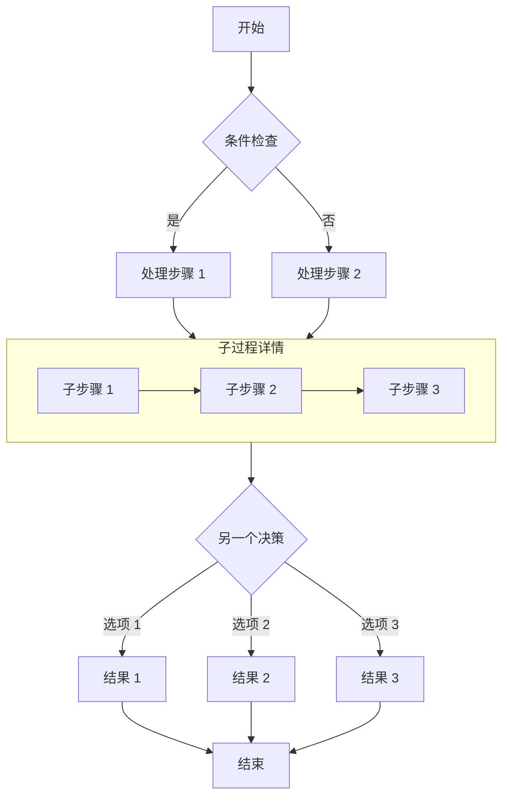
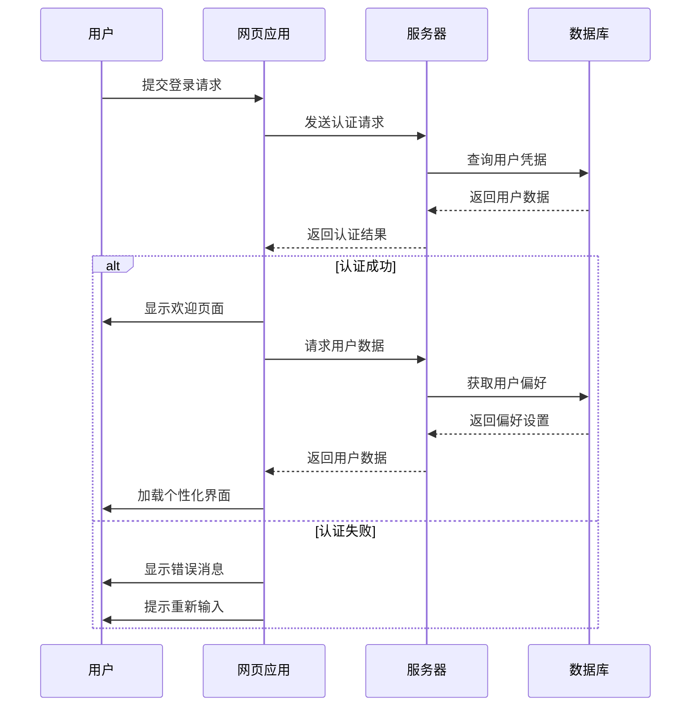
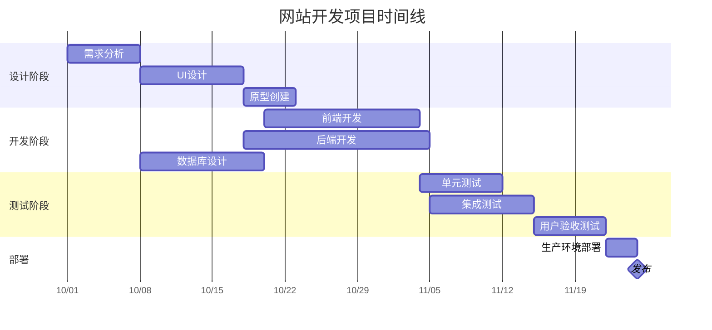
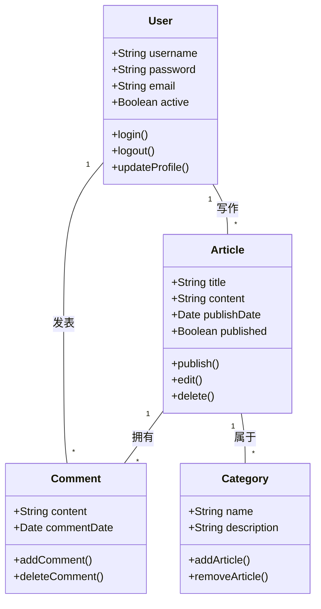
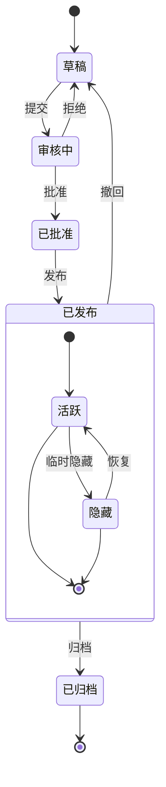
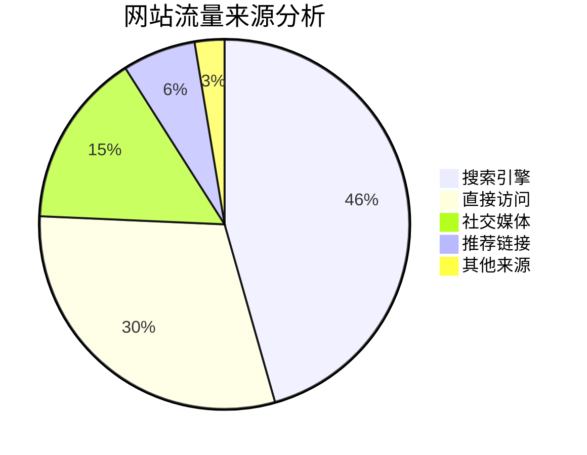

<!-- 文章内搜索栏 -->

  <button id="article-search-btn" onclick="toggleArticleSearch()">
    <svg width="16" height="16" viewBox="0 0 24 24" fill="none" stroke="currentColor" stroke-width="2.5" stroke-linecap="round" stroke-linejoin="round"><circle cx="11" cy="11" r="8"/><line x1="21" y1="21" x2="16.65" y2="16.65"/></svg>
    搜索文章
  </button>
  

    

      <svg width="18" height="18" viewBox="0 0 24 24" fill="none" stroke="currentColor" stroke-width="2.5" stroke-linecap="round" stroke-linejoin="round"><circle cx="11" cy="11" r="8"/><line x1="21" y1="21" x2="16.65" y2="16.65"/></svg>
      <input type="text" id="article-search-input" placeholder="输入关键词搜索..." autocomplete="off" />
      
      <button id="article-search-prev" onclick="articleNav(-1)" title="上一个" disabled>▲</button>
      <button id="article-search-next" onclick="articleNav(1)" title="下一个" disabled>▼</button>
      <button id="article-search-close" onclick="closeArticleSearch()" title="关闭">✕</button>
    

  

## Markdown 中 Mermaid 图表完整指南

本文演示如何在 Markdown 文档中使用 Mermaid 创建各种复杂图表，包括流程图、时序图、甘特图、类图和状态图。

## 流程图示例

流程图非常适合表示流程或算法步骤。

## 时序图示例

时序图显示对象之间随时间的交互。

## 甘特图示例

甘特图非常适合显示项目进度和时间线。

## 类图示例

类图显示系统的静态结构，包括类、属性、方法及其关系。

## 状态图示例

状态图显示对象在其生命周期中经历的状态序列。

## 饼图示例

饼图非常适合显示比例和百分比数据。

## 总结

Mermaid 是在 Markdown 文档中创建各种类型图表的强大工具。本文演示了如何使用流程图、时序图、甘特图、类图、状态图和饼图。这些图表可以帮助您更清晰地表达复杂的概念、流程和数据结构。

要使用 Mermaid，只需在代码块中指定 mermaid 语言，并使用简洁的文本语法描述图表。Mermaid 会自动将这些描述转换为美观的可视化图表。

尝试在您的下一篇技术博客文章或项目文档中使用 Mermaid 图表 - 它们将使您的内容更加专业且更易理解！
